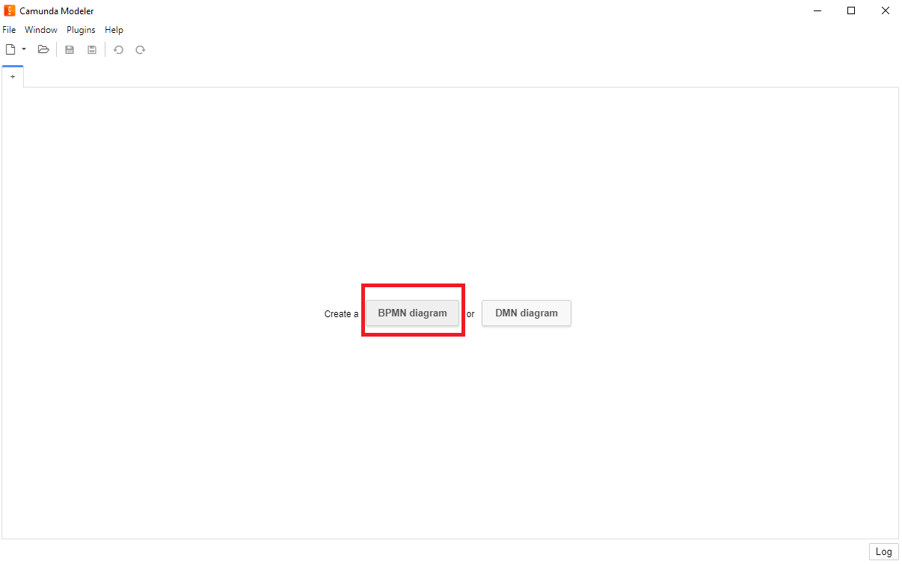
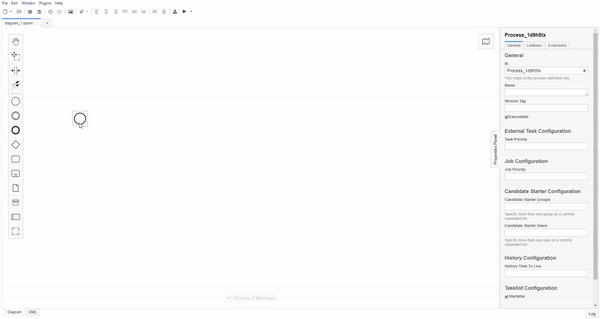

# Tutorial

In the following, it is described how to set up the QuantME Modeling and Transformation Framework, create a [QRM repository](../QRM-Repository) with one [QRM](../QRM), and use it to transform an example QuantME workflow to a workflow containing only native BPMN modeling constructs.

1. Clone the QuantME Modeling and Transformation Framework: 

`git clone https://github.com/UST-QuAntiL/QuantME-TransformationFramework.git`

2. Create a Github repository for your QRMs. 
In the following we will assume the repository is available under the `UST-QuAntiL` Github organization and has the repository name `qrm-test`.
Please adapt these values to your setup in the following steps.

3. Configure the QuantME Modeling and Transformation Framework to use the created QRM repository:
- Navigate to the configuration file that is located [here](../../../resources/plugins/QuantME-ClientPlugin/client/Config.js)
- Insert the user/organisation name and repository name:

```JS
export const config = {
  githubUsername: 'UST-QuAntiL',
  githubRepositoryName: 'qrm-test'
};
```

4. Start the QuantME Modeling and Transformation Framework:
- In development mode: Build the plugins contained in this [folder](../../../resources/plugins) and then run ```npm run install``` and ```npm run dev``` in the root folder.
Then, the framework will start automatically.
- In production mode: Run ```npm run install``` and ```npm run build```.
The application is build in ```.\dist``` and can be started depending on your operating system.

5. Use the framework to create a QRM:
- Open a new BPMN diagram:
<kbd></kbd>
- Delete the start event and add a new task:
<kbd></kbd>
- Replace the task by a task of type ```ReadoutErrorMitigationTask```

- TODO

TODO
